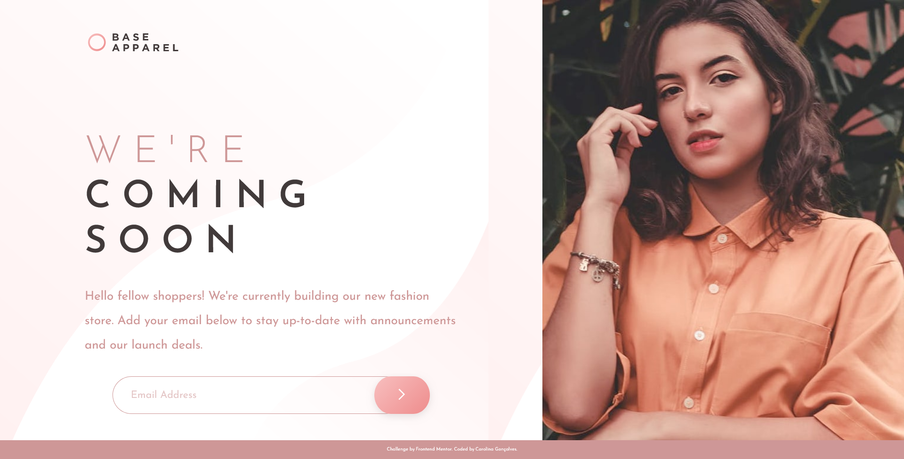

Claro, aqui está a tradução para markdown:

```markdown
# Frontend Mentor - Solução para a Página Em Breve da Base Apparel


Esta é uma solução para o desafio [Base Apparel coming soon page challenge on Frontend Mentor](https://www.frontendmentor.io/challenges/base-apparel-coming-soon-page-5d46b47f8db8a7063f9331a0). Os desafios do Frontend Mentor ajudam a melhorar suas habilidades de codificação ao construir projetos realistas.

#### Documentação do Projeto
[Documentação em Inglês](README.md)

## Sumário

- [Visão Geral](#overview)
  - [O desafio](#the-challenge)
  - [Captura de Tela](#screenshot)
- [Meu Processo](#my-process)
  - [Construído com](#built-with)
  - [O que aprendi](#what-i-learned)
- [Autora](#author)
- [Agradecimentos](#acknowledgments)

## Visão Geral

### O Desafio

Os usuários devem ser capazes de:

- Visualizar o layout ideal para o site, dependendo do tamanho da tela do seu dispositivo
- Ver estados de hover para todos os elementos interativos na página
- Receber uma mensagem de erro quando o `formulário` é enviado se:
  - O campo `input` estiver vazio
  - O endereço de e-mail não estiver formatado corretamente

### Captura de Tela

| Desktop                                    | Mobile                                    | 
| ------------------------------------------ | ----------------------------------------- |
|        |        | 


### Links

- [URL da Solução](https://github.com/uber-sleep/base-apparel-coming-soon-master)
- [URL do Site Ao Vivo](https://uber-sleep.github.io/base-apparel-coming-soon-master/)

## Meu Processo

### Construído com

- **HTML5 Semântico** - Marcação estruturada e significativa
- **Propriedades Personalizadas CSS** - Utilização de propriedades personalizadas para estilização
- **Flexbox** - Layout de flexbox para design eficiente
- **CSS Grid** - Layout baseado em grid para estrutura eficaz
- **JavaScript** - Adição de interatividade e validação de formulário
- **Fluxo de Trabalho Mobile-first** - Design e desenvolvimento com foco inicial em dispositivos móveis

### O que aprendi

Desenvolver a Página Em Breve da Base Apparel aprimorou minhas habilidades de front-end, concentrando-se no design responsivo. Este projeto proporcionou uma experiência valiosa na criação de páginas da web com uma abordagem mobile-first, enfatizando o design e o desenvolvimento adaptados para telas menores. Além disso, adquiri insights sobre a validação de formulários com JavaScript, aprimorando minhas habilidades no manuseio de entrada do usuário, verificação de campos vazios e validação de formato de e-mail.

## Autora

- [LinkedIn](https://www.linkedin.com/in/carolina-goncalves-/)
- [Github](https://github.com/uber-sleep)
- [Frontend Mentor](https://www.frontendmentor.io/profile/uber-sleep)
```